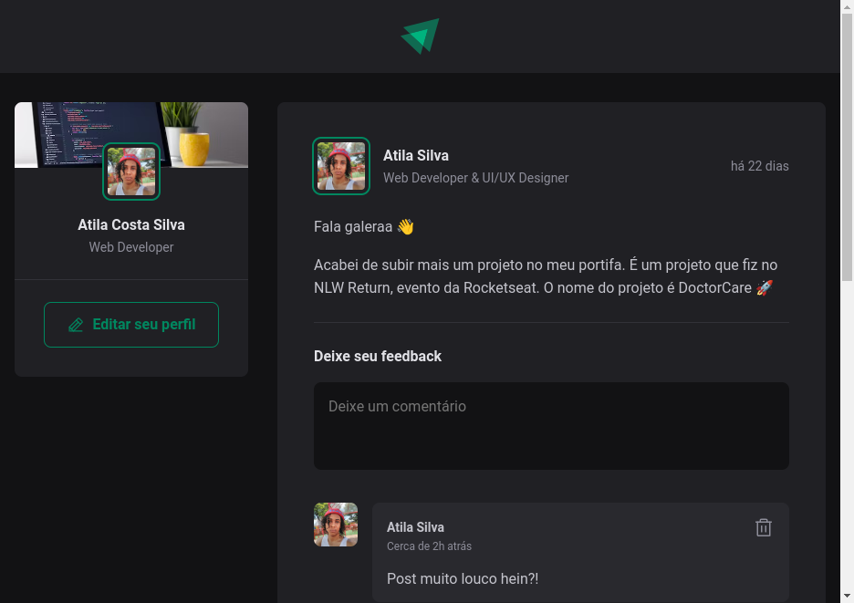

# <div align="center" >**Bases of ReactJS**</div>

Esse projeto foi desenvolvido no curso *Fundamentos do ReactJS* da @Rocketseat.

Nele construímos uma aplicação utilizando das melhores práticas no contexto de aprendizado para resolver problemas!



---
## 🚀 Como Utilizar

1. Faça a instalação do zip do projeto
2. Entre nele via terminal
3. Execute o comando ```npm i```
4. Em seguida o comando ```npm run dev```
5. Por fim abra o localhost no navegador.
